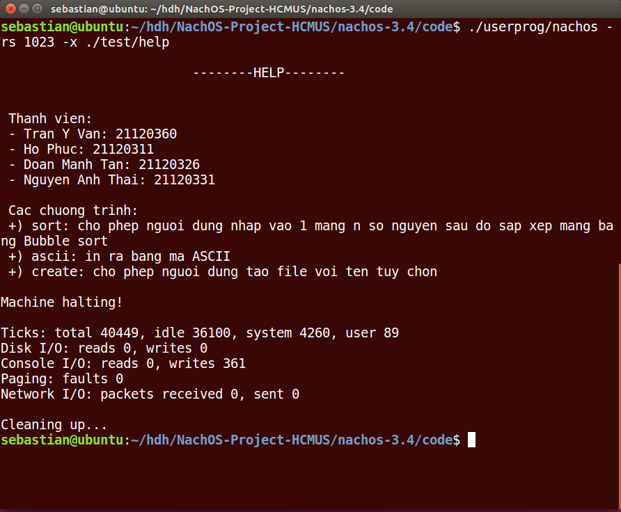
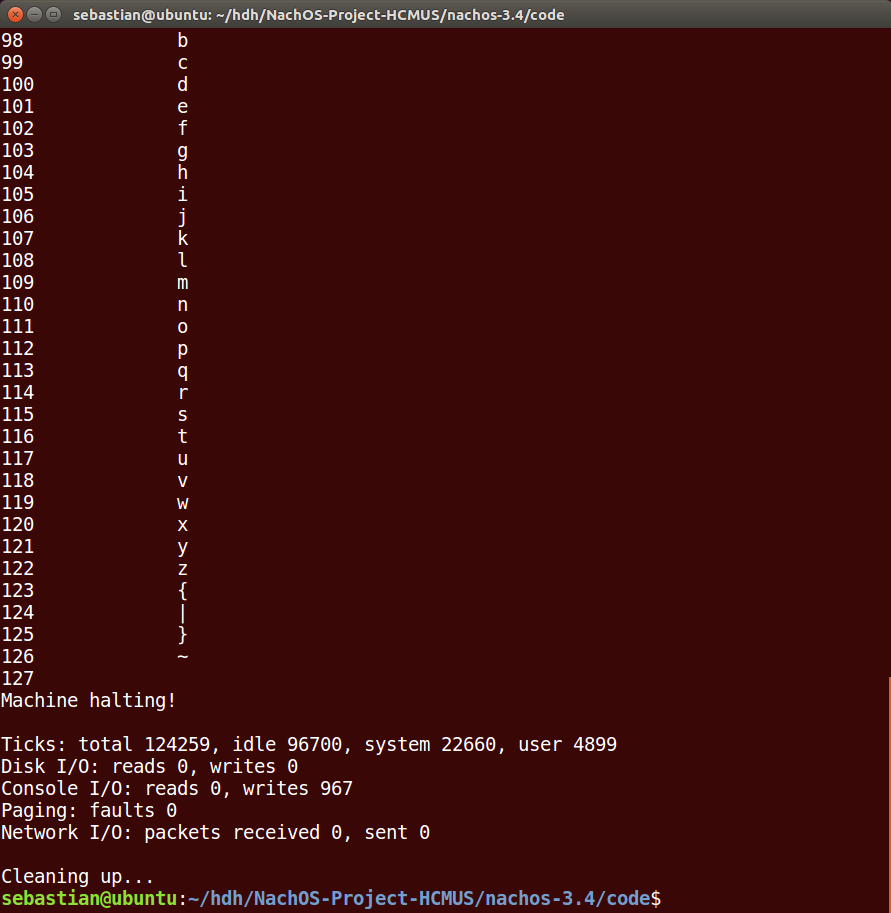
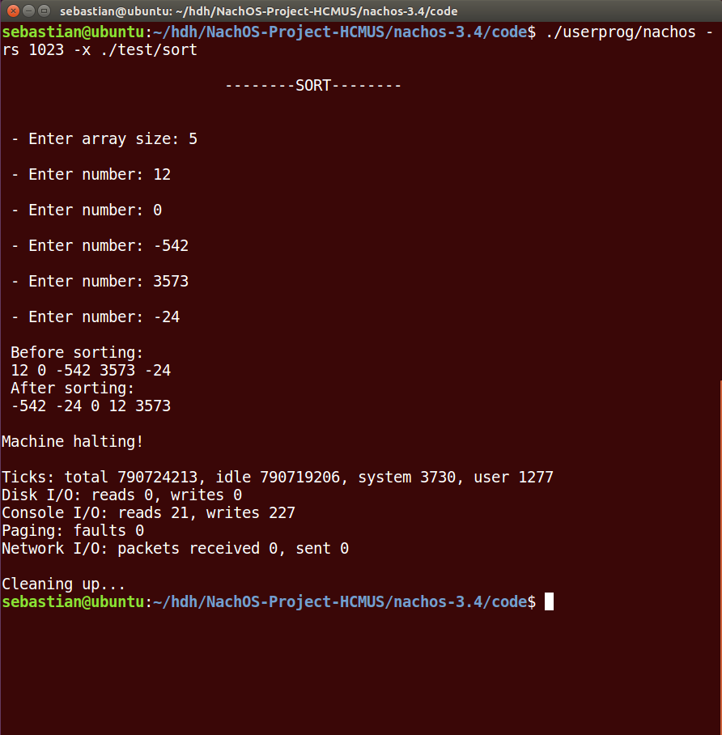
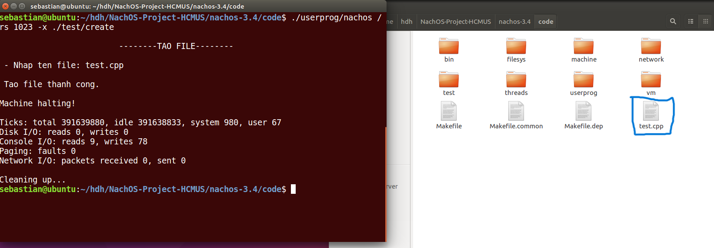

# NachOS-Project-HCMUS
HCMUS - 21_3 - NachOS Project - Operating System

GV: **Lê Viết Long**

## Thành viên
- Trần Ý Văn: 21120360
- Hồ Phúc: 21120322
- Đoàn Mạnh Tân: 21120326
- Nguyễn Anh Thái: 21120331

## Mô tả
- Đồ án được cung cấp một hệ điều hành đơn giản chưa xử lý nhiều đối với người dùng. Đồ án yêu cầu viết tiếp các chức năng để người dùng
có thể giao tiếp với hệ thống.
- Môi trường lập trình: Linux (Ubuntu 16.04 32bit).

## Chức năng
- Xử lý các System Calls: đọc và in ra từ luồng đọc và ghi các kiểu dữ liệu cơ bản như int, char, string(char*).
- Xử lý các exception căn bản khi chạy hệ điều hành
- Các chương trình cơ bản bao gồm:
  * **help**: in ra các dòng giới thiệu cơ bản về nhóm và các chương trình khác
  * **ascii**: in ra bảng mã ascii
  * **sort**: cho phép người dùng nhập vào một mảng số nguyên có **n** phần tử (n do người dùng nhập) rồi sắp xếp tăng dần sử dụng Bubble Sort
  * **create**: cho phép người dùng tạo tập tin với tên tùy chọn

## Demo
**help**

**ascii**

**sort**

**create**

